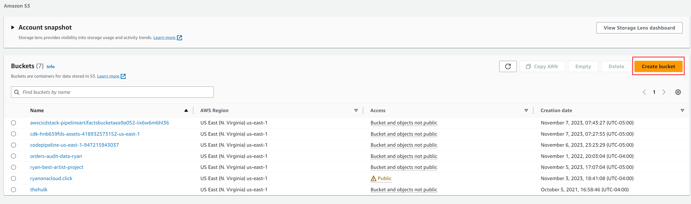
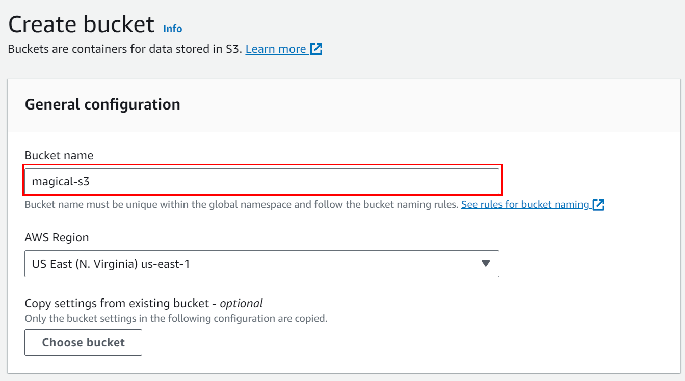
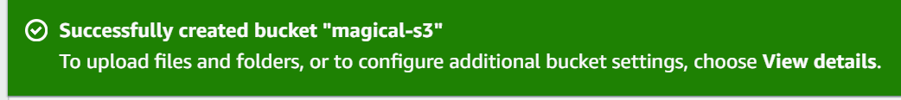

# Amazon S3 (Simple Storage Service): Gateway to Cloud Storage Awesomeness

Welcome to my Amazon S3 (Simple Storage Service) GitHub repo. If you're ready to embark on an exciting journey through the cloud and solidify  knowledge of AWS S3 with me, you're in the right place. Buckle up, because we're about to dive into the fascinating universe of Amazon S3.

## Table of Contents

- [Introduction](#introduction)
- [Key Concepts Unleashed](#key-concepts-unleashed)
  - [Buckets:  Cloud Closets](#buckets--cloud-closets)
  - [Objects: The Digital Treasures](#objects-the-digital-treasures)
  - [Regions: Where Data Takes Flight](#regions-where-data-takes-flight)
- [Getting Started:  AWS Odyssey Begins](#getting-started--aws-odyssey-begins)
- [S3  Walkthrough](#s3-walkthrough)
  - [Create an S3 Bucket](#create-an-s3-bucket)
  - [Upload Files](#upload-files)
  - [Bucket Policies](#bucket-policies)
  - [S3 Bucket Policy Explanation](#s3-bucket-explanation)
  - [Components of an S3 Bucket Policy](#components-of-an-s3-bucket-policy)
  - [Policy Summary](#policy-summary)
- [Best Practices: Sailing Smooth in the Cloud](#best-practices-sailing-smooth-in-the-cloud)
- [Resources for Further Learning:  Cloudy Playground](#resources-for-further-learning--cloudy-playground)

## Introduction

Amazon S3, also known as Simple Storage Service, is like a treasure chest in the sky, where  data dreams come true. Imagine a place where you can store and retrieve data of all shapes and sizes, accessible from anywhere on the web. That's S3 –  ticket to the cloud storage wonderland.

## Key Concepts Unleashed

### Buckets:  Cloud Closets

Buckets are like magic closets in the cloud. They can hold digital goodies – files, images, videos – in an organized and secure manner. Just remember, each bucket needs a unique name worldwide.  own slice of the cloud!

### Objects: The Digital Treasures

Objects are the jewels within  cloud closets. Each one has a unique key, just like a treasure map. Objects can be anything you cherish, from family photos to important documents. It's like having  own vault in the sky.

### Regions: Where Data Takes Flight

AWS S3 operates in multiple regions across the globe. These regions are like different cities in the cloud world. Choose a region wisely, considering speed, compliance, and global data distribution.


## S3 Walkthrough

# AWS S3 Bucket Creation and File Upload Guide

## Create an S3 Bucket

1. Sign in to the AWS Management Console and open the Amazon S3 console at `https://console.aws.amazon.com/s3/`.
2. Click **Create bucket**.

3. Provide a unique DNS-compliant bucket name (for example, I used `magical-s3`).

4. Select a Region to create  bucket in.
5. (Optional) Choose to copy settings from an existing bucket, or proceed to configure options.
6. Set options like versioning, logging, tags, etc., as needed.
7. Review and create the bucket.



## Upload Files

1. Click on newly created bucket.
2. Click **Upload** to add files.
3. You can drag and drop files or browse to select them. (I uploaded a pic of the best dog breed)

4. Set file permissions and properties as needed.
5. Click **Upload** to start the process.


# Bucket Policies

Bucket policies in AWS S3 are used to grant permission to resources in your bucket.

1. I chose to use a Read-Only Access to an Anonymous User - policy grants read-only permission to any user on the internet for all objects in your S3 bucket.
```js {
  "Version": "2012-10-17",
  "Statement": [
    {
      "Sid": "PublicReadForGetBucketObjects",
      "Effect": "Allow",
      "Principal": "*",
      "Action": "s3:GetObject",
      "Resource": "arn:aws:s3:::YourBucketName/*"
    }
  ]
}
```

# S3 Bucket Policy Explanation

This document provides an explanation of the various components of an S3 bucket policy.

## Components of an S3 Bucket Policy

- **Version**: Defines the version of the policy language in use. The current version is `"2012-10-17"`.

- **Statement**: The core element of the policy, an array of individual statements, each describing specific permissions.

  - **Sid (Statement ID)**: An optional identifier for the policy statement. For example, `"PublicReadForGetBucketObjects"` indicates public read access for retrieving bucket objects.

  - **Effect**: Specifies whether the policy will `"Allow"` or `"Deny"` the permissions described. In this case, `"Allow"`.

  - **Principal**: Defines the user, account, service, or other entity that the policy applies to. `"*"` implies it applies to everyone, including anonymous users.

  - **Action**: Describes the allowed or denied actions. `"s3:GetObject"` allows retrieval of objects from the bucket, making the policy read-only.

  - **Resource**: Specifies the objects the policy applies to. `"arn:aws:s3:::YourBucketName/*"` refers to all objects in `"YourBucketName"`, with `"*"` as a wildcard.

## Policy Summary

The policy allows any user on the internet to read and download objects from the specified S3 bucket. However, it does not permit listing the bucket's contents, uploading, modifying, or deleting objects. For listing, you would need to include the `"s3:ListBucket"` action. Caution is advised when providing open access to S3 resources.


## Best Practices: Sailing Smooth in the Cloud

When sailing the cloudy seas with Amazon S3:

- Give  buckets meaningful names and make them unique.
- Embrace versioning to secure critical data.
- Automate data management with lifecycle policies.
- Prepare for the storm with cross-region replication.
- Keep an eye on  S3 kingdom with AWS CloudWatch metrics and logs.

## Resources for Further Learning:  Cloudy Playground

To continue  Amazon S3 quest and become a cloud guru:

- [AWS S3 Documentation](https://docs.aws.amazon.com/s3/index.html)
- [AWS S3 Developer Guide](https://docs.aws.amazon.com/AmazonS3/latest/dev)
- [AWS S3 FAQs](https://aws.amazon.com/s3/faqs/)


